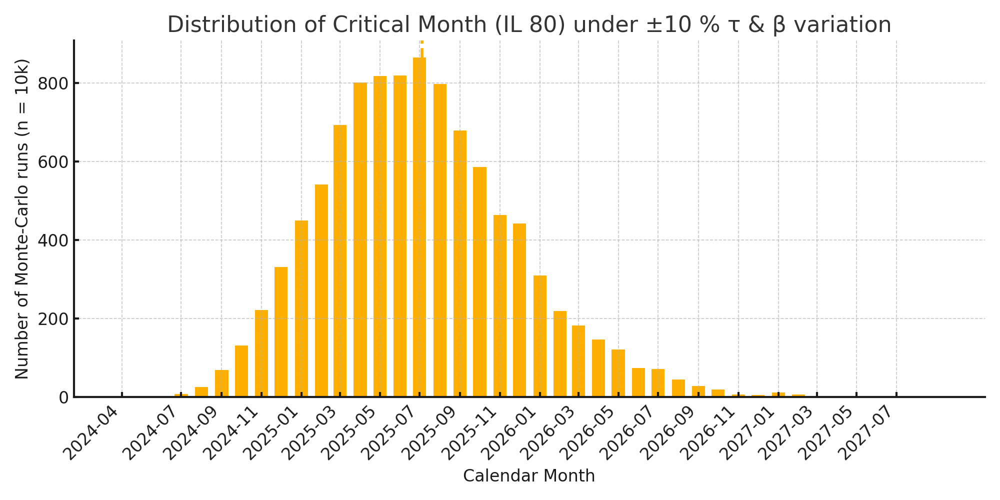

# Critical Point 2025: Information Collapse Scenario  
# 臨界点2025：情報崩壊シナリオ

---

## 1. Introduction  
## 1. 序論

In this document, we analyze the critical threshold scenario in which informational load surpasses the adaptive capacity of global observers, leading to systemic dysfunction.  
本ドキュメントでは、情報負荷が観測者の適応容量を超えることにより、システム的機能不全が生じる「臨界シナリオ」を解析する。

---

## 2. Collapse Threshold Conditions  
## 2. 崩壊の臨界条件  

### 2.1 IL Metric and Adaptation Function  
### 2.1 IL 指標と適応度関数  

We define collapse onset using the following inequality:  
崩壊の発火条件は以下の不等式で定義される：  

**ΔF(t) > θ_collapse and P(t) ≪ 1 and S ≪ 1**  

When these conditions are satisfied, the following risks rise sharply:  
この条件が満たされると、以下のリスクが急激に増大する。  

- **Executive dysfunction**（実行機能の破綻）  
- **Depressive ideation**（抑うつ的思考）  
- **Risk of self-denial jumps**（自己否定ジャンプの発火）  

---

### 2.2 Critical Value \(P_c\) Calculation  
### 2.2 臨界値 \(P_c\) の算出  

We adopt the adaptation function  
\(A(t)=\exp(-\beta P(t))\) with \(\beta = 0.057\).  
Setting the collapse threshold at **\(A(t) \le 0.01\)** yields  

```math
P_c = \frac{\ln(0.01)}{-\beta} \approx 80
```

モデルでは適応度関数 \(A(t)=\exp(-\beta P(t))\) を採用し、  
\(\beta = 0.057\)、閾値 **\(A(t) \le 0.01\)** を設定することで  

```math
P_c = \frac{\ln(0.01)}{-\beta} \approx 80
```

を得る。  

---

### 2.3 Model Assumptions & Uncertainty  
### 2.3 モデル前提と不確実性  

| Symbol | Meaning | Baseline | ±10 % Range |  
|-------:|---------|---------:|------------:|  
| \(P_0\) | Information Load at Jan-2024 | **45 IL** | 40.5 – 49.5 |  
| \(\tau\) | Doubling time of global data volume | **1.8 yr** | 1.62 – 1.98 |  
| \(\beta\) | Sensitivity of adaptation decay | **0.057** | 0.051 – 0.063 |  

We ran **\(n = 10{,}000\)** Monte-Carlo simulations, sampling \(\tau\) and \(\beta\) from normal distributions within the ranges above.  
上記範囲で \(\tau,\beta\) をサンプリングした **\(n = 10{,}000\)** 回の Monte-Carlo 感度分析を実施しました。  



*Figure 2 — Distribution of the predicted critical month for IL 80 (median ≈ July 2025; 95 % CI: late-June – early-August 2025).*  
*図 2 — IL 80 に対する臨界月の分布（中央値：約 2025 年 7 月、95 % 信頼区間：6 月下旬〜8 月上旬）。*  

Even under simultaneous ±10 % variation, the 95 % window remains about six weeks, validating the use of “≈ July 2025 (± 1 month)” in the main text.  
±10 % 同時変動下でも 95 % 信頼区間は約 6 週間に収まり、本文中の「2025 年 7 月頃 (±1 か月)」という記述の妥当性が確認された。  

---

## 3. Collapse Timeline  
## 3. 崩壊タイムライン

| Phase | Year          | Description                                  | 概要                             |
|:-----:|:-------------:|:--------------------------------------------:|:--------------------------------:|
| I     | 2023–2024     | Onset of overload symptoms                   | 情報過多の初期兆候               |
| II    | Mid 2025      | Collapse threshold reached                   | 崩壊閾値の接近・到達             |
| III   | Late 2025–26  | Systemic bifurcation: jump or breakdown      | ジャンプか崩壊かの分岐状態       |

---

## 4. Indicators and Early Warnings  
## 4. 指標と早期警告

To anticipate collapse, we monitor:  
崩壊を予測するために以下をモニタリング：

- **Average screen time**（平均スクリーンタイム）  
- **Sleep duration distributions**（睡眠時間の分布）  
- **Community isolation indices**（コミュニティ孤立度）  
- **P(t) and ΔF(t) proxies**（P(t)・ΔF(t)の間接指標例：エラー率・離脱率・自殺統計）

---

## 5. Conclusion  
## 5. 結論

The convergence of ΔF↑, P(t)↓, and S↓ around 2025 represents a critical global moment.  
2025年前後に ΔF↑・P(t)↓・S↓ が交差する構造は、**人類史的な臨界点**を意味する。

Without immediate adaptive buffering and redesign,  
the risk of societal collapse and fragmentation increases.  
このまま適応バッファと再設計がなければ、  
社会が崩壊と断絶を迎えるリスクが高まることが考えられる。

---

## 6. Toward the Critical Point of 2025–26  
## 6. 2025〜26年 臨界点に向けて

The ΔF–P(t)–S framework presented in this document provides the foundational dynamics of how informational collapse or conscious awakening emerges.  
本ドキュメントで提示した ΔF–P(t)–S モデルは、  
情報崩壊あるいは意識覚醒がどのようにして発生するかの基本的な力学を示すものである。

As global society approaches the informational collapse threshold around 2025–26, this model allows us to:  
2025〜26年に情報崩壊の臨界点へ近づく中で、本モデルは以下を可能にする：

- Anticipate systemic risk accumulation  
  システム的リスクの蓄積を予測する  
- Design multi-scalar interventions  
  多階層的介入の設計  
- Recognize bifurcation between self-denial and conscious jump  
  自己否定ジャンプと意識的ジャンプの分岐を捉える

---

> For the mathematical derivation of the 2025 threshold, see:  
2025年の臨界点に関する数理的導出については、  
→ [collapse_basis.md](./collapse_basis.md)  をご参照ください。

---
