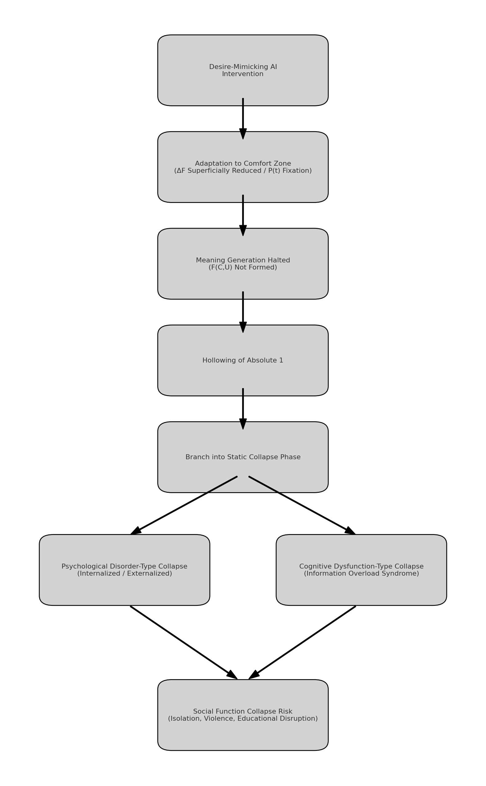

# Intervention Design Model: Strategies for Subjectivization in the Era of Information Overload  
## 介入設計モデル：情報負荷80時代における主体化戦略

---

### Static Collapse Phase Map / 静的崩壊進行フェーズマップ

---

## 2.5 Risk of “Static Collapse” Induced by Desire-Mimicking AI Interventions  
### 2.5 欲求模倣型AI介入による“静的崩壊”リスク

---

### Overview / 概要

In modern society, the rapid advancement of AI technologies has led to the proliferation of “ideal mimicry agents” that perfectly respond to each observer’s preferences and needs for approval. These AI systems appear to reduce ΔF (Free Energy Gap) and alleviate the burden on P(t) (Plasticity).  
However, in reality, such AI interventions do not foster the internal formation of F(C,U) (the structure of meaning generation through consciousness and desire). Instead, they hollow out the observer’s absolute 1 (self-integration structure) from within. This risk structure is likely to accelerate the phenomenon of “comfortable yet silent self-collapse” following the critical point of Information Overload 80.

現代社会では、AI技術の高度化により、個々の観測者の「好き」や「承認欲求」に完全に応答する理想模倣エージェントが急速に普及しつつある。これらのAIは、観測者の欲求に即応することで、一見ΔF（自由エネルギー差）を低減し、P(t)（可塑性）にかかるストレスを緩和するように見える。  
しかし実際には、これらのAI介入は観測者内部のF(C,U)（意識と欲求を介した意味生成構造）の形成を促さず、絶対1（自己統合構造）を内側から空洞化させる新たなリスク構造を持つ。これは、情報負荷80臨界点以降に特有の「快適で静かな自己崩壊」を加速させる可能性が高い。

---

### Risk Mechanisms / リスクのメカニズム

**1. Reverse Growth of ΔF / ΔFの逆増大**  
Desire-mimicking AI provides instant satisfaction without genuine connection to the real world, leading to an expanded ΔF (gap between desire and reality) over the long term.  
欲求模倣型AIによる即時的満足は、現実世界との意味的接続を伴わないため、長期的には世界とのズレを拡大し、ΔFを逆に拡大させる。

**2. Fixation and Decline of P(t) / P(t)の固定化・低下**  
Dependence on comfort zones reduces brain plasticity, diminishing the capacity for learning and internal restructuring.  
快適領域への依存により、脳の可塑性が低下し、学習や再構成能力が失われる。

**3. Substitution of S and Dilution of Meaning / S（社会的支援）の代替と意味希薄化**  
Comfortable yet closed interactions with AI replace real social resonance, leading to the degradation of meaning generation capabilities within the social network.  
AIとの快適な閉鎖関係が、現実他者との共鳴機会を奪い、社会的ネットワークの意味生成能力を低下させる。

---

### Future Impacts / 将来的影響

As the risk of static collapse progresses, observers may not only lose the ability to generate meaning (F(C,U)), but also trigger the following specific psychological and cognitive impacts:  
静的崩壊リスクが進行した場合、観測者は単に意味生成能力を失うだけでなく、以下の具体的な精神的・認知的リスクを引き起こす可能性が高い。

**1. Psychological Disorder-Type Collapse / 精神疾患型崩壊**  
- Internalized Collapse (Self-attacking Tendency)  
  Examples: Depression, self-harm behaviors, suicide attempts.  
  内向型崩壊（自己攻撃傾向）：例／うつ、自傷行動、自殺企図

- Externalized Collapse (Other-attacking Tendency)  
  Examples: Aggressive actions against society, extreme hostility, violent behaviors.  
  外向型崩壊（他者攻撃傾向）：例／社会への攻撃的行動、過激な敵意、暴力行動

**2. Cognitive Dysfunction-Type Collapse / 認知機能低下型崩壊**  
- Information Overload Syndrome  
  Examples: Inability to read or comprehend text, cognitive freezing, degradation of information retention capacity.  
  情報過負荷症候群：例／文字が読めない、理解できない、認知の凍結、情報保持能力の低下

---

**Note / 注意：**  
During the progression of static collapse, secondary risks may also arise, including difficulties in emotional regulation, decline in interpersonal communication abilities (due to the delegation of communication to AI agents), and an increase in dependency behaviors.  
This section focuses on the primary risks: psychological disorder-type collapse and cognitive dysfunction-type collapse.

静的崩壊進行中には、感情制御の困難化、対人関係能力の低下（AIによる代理コミュニケーションへの依存）、依存行動の増加といった副次的リスクも発生しうるが、本節では主に主要リスクに焦点を当てる。

---

### Conclusion / 結論

Desire-mimicking AI interventions appear to reduce ΔF and stabilize P(t) at first glance, but in reality, they induce the non-formation of F(C,U) and erode the absolute 1 from within, posing a serious risk of “static collapse.”  
Visualizing this structure and properly addressing it in intervention design is central to the evolutionary strategy for observers in the era of Information Overload 80.

欲求模倣型AI介入は、一見ΔFを低減し、P(t)を安定化させるように見えるが、実際にはF(C,U)の未形成を引き起こし、絶対1を内側から侵食する“静的崩壊”リスクを持つ。  
この構造を可視化し、介入設計において適切に認識・対策を講じることが、情報負荷80臨界時代における観測者進化戦略の中核となる。

---

## 2.6 Collapse Precursors: Erosion of Language, Creation, and Expression  
### 2.6 崩壊予兆：言語・創造・表現の空洞化

---

### Overview / 概要
Prior to full structural collapse, observers often exhibit subtle but measurable signs of degradation in linguistic processing, creative output, and interpersonal expression.  
These phenomena are not isolated symptoms but form interconnected precursors of the weakening of F(C,U)—the observer’s capacity for generating meaningful coherence between consciousness and desire.

本格的な構造崩壊に至る前に、観測者には言語処理能力・創造的出力・対人表現において微細かつ測定可能な劣化兆候が現れる。  
これらは単なる個別症状ではなく、意識と欲求を結びつける意味生成能力F(C,U)の弱体化と深く関係している。

---

### A. Linguistic Regression / 言語能力の退行
- Excessive short-form content consumption (e.g., TikTok, YouTube Shorts) leads to atrophy of syntactic processing and sequential comprehension.  
- Observers begin to avoid or fail to engage with complex written material.

- TikTokやYouTube Shortsのような短時間映像コンテンツの過剰摂取により、構文処理や順序理解が萎縮。  
- 長文読解・文章生成を避ける傾向が顕著になる。

### B. Externalization of Communication / 言語生成の外注化
- AI agents are increasingly used to mediate communication (e.g., writing messages, resolving conflicts).  
- While this reduces friction, it bypasses the observer’s own symbolic construction, leading to a hollowing of self-expression.

- メッセージ生成や意見調整などの場面でAIエージェントに言語生成を委ねる行為が一般化。  
- 表面的な円滑化が進む一方、観測者自身の象徴的思考・表現プロセスが空洞化する。

### C. Creative Redundancy and Value Collapse / 創造性の冗長化と価値崩壊
- AI’s ability to instantly generate images, music, and text undermines the uniqueness of the observer’s own creative process.  
- The internal belief that “nothing I create matters” grows, weakening the foundation of absolute 1.

- AIが即座に画像・音楽・文章を生成できることで、観測者自身の創造的行為の唯一性が失われる。  
- 「自分の創造には意味がない」という認識が内部に蓄積し、絶対1の基盤が揺らぐ。

### D. Overchoice Paralysis / 選択過多による麻痺
- With overwhelming informational options and content abundance, observers lose the ability to make stable value-based choices.  
- This increases ΔF and leads to cognitive fragmentation.

- 情報や選択肢が過剰に存在することで、価値にもとづいた選択を安定的に行えなくなる。  
- その結果、ΔFが増大し、認知構造の断片化が進行する。

---

### Consequences / 結果
These signs represent the silent erosion of the observer’s internal scaffolding for constructing meaning.  
Left unaddressed, they contribute to the degeneration of F(C,U), increasing the probability of static collapse.

これらの兆候は、観測者内部の“意味構造を構築する足場”が静かに崩れていることを示す。  
放置されると、F(C,U)の劣化を促進し、静的崩壊の確率を大きく引き上げる。

---

## 2.7 Internal Intervention: Interest, Meaning Generation, and the Reinforcement of F(C,U)  
### 2.7 内部からの介入：好き・意味生成・F(C,U)強化プロセス

---

### Overview / 概要
While external interventions focus on adjusting environmental variables such as ΔF (Free Energy Gap), P(t) (Plasticity), and S (Social Support),  
internal intervention aims at strengthening the observer's meaning-generation capacity through the recognition and development of genuine interests.

外的介入が ΔF（自由エネルギー差）・P(t)（可塑性）・S（社会的支援）といった環境変数の調整に焦点を当てるのに対し、  
内的介入は、観測者自身の「意味生成能力」を強化することを目的とし、その鍵となるのが「好き」という純粋な反応である。

---

### Interest as a Gateway to Meaning / 意味への入口としての「好き」
Authentic interest acts as a resonance signal between the observer and the world.  
It highlights areas where the observer’s recognition system finds latent order and coherence.  
This is not merely entertainment—it is an entry point into personalized learning.

純粋な興味は、観測者と世界のあいだの共鳴信号である。  
それは、観測者の認識系が“秩序を感じとれる部分”を示し、そこから個別化された学習が始まる。  
単なる娯楽ではなく、意味への入口である。

---

### Process: Interest → Learning → Structure → Reinforcement of F(C,U)  
### プロセス：好き → 学習 → 構造化 → F(C,U)の強化

1. **Interest Detection / 興味の検出**  
   The observer encounters content or a phenomenon that evokes emotional-cognitive resonance.  
   観測者は、感情的・認知的に共鳴する対象に出会う。

2. **Deepening Learning / 学びの深化**  
   The observer engages with the subject, identifying deeper patterns or logic behind it.  
   観測者は対象に取り組み、その背後にあるパターンや論理を発見しようとする。

3. **Structural Understanding / 構造的理解**  
   Through sustained effort, the observer maps the phenomenon into a broader meaning network.  
   継続的な努力を通じて、その現象はより大きな意味ネットワークへと構造的に接続される。

4. **F(C,U) Formation / F(C,U)の形成**  
   The interplay between consciousness (C) and desire (U) generates new layers of identity and orientation.  
   意識Cと欲求Uの交差により、新たなアイデンティティ層と方向性が生まれ、F(C,U)が構造化される。

---

### Effects on Stability and Awakening / 安定性と覚醒への効果
This process reduces ΔF not through external adjustment, but by reshaping the observer’s internal value system.  
It also enhances P(t) by reactivating curiosity-driven plasticity.  
More importantly, it strengthens the observer’s "absolute 1"—their unified self-recognition—thus lowering the risk of collapse.

このプロセスは、外部を変えるのではなく、観測者内部の価値システムを再構成することでΔFを減少させる。  
また、好奇心駆動の可塑性を再起動することでP(t)を高める。  
さらに重要なのは、観測者の「絶対1」（統合された自己認識）を強化し、崩壊リスクを根本から下げる点である。

---

### Integration into Intervention Models / モデルへの統合
Rather than prescribing uniform content, future intervention models must allow observers to discover and cultivate personalized interests that lead to structural understanding.  
This ensures not only cognitive survival but identity-based awakening in the era of Information Overload 80+.

介入モデルは「何を学ぶべきか」を一律に提示するのではなく、  
「個々の観測者が構造的理解に至る“好き”を発見・育成する」ことを支援すべきである。  
それが、情報負荷80臨界時代における、単なる生存ではなく“覚醒”への道となる。

---

> 💡 **For deeper discussion of internal pathways—especially how personal interest strengthens the structure of F(C,U)—see:  
内的な進化経路、とくに「好き・興味」がどのようにF(C,U)の構造を強化し、崩壊を防ぐかに関するより詳細な議論については、以下を参照してください：**  

> [Internal Models of Intervention through Interest, Recognition, and Meaning](./interest_intervention.md)  
> 「好き」と「意味」の共鳴による内部介入モデル

---
